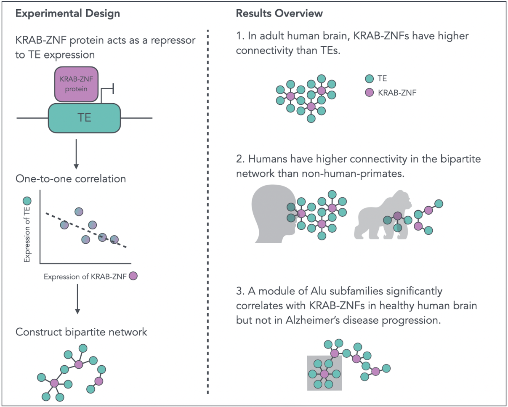

# Paper title


This repo including the analysis code in the paper, \_\_\_\_\_. You can refer to the script based on the description below.



## preTEKRABber pipeline is provided

We use [TEKRABber package](https://bioconductor.org/packages/release/bioc/html/TEKRABber.html) to analyze the one-to-one correlations (TE:KRAB-ZNF) from expression data. For obtaining our expression data, we first use a [preTEKRABber pipeline](https://github.com/ferygood/preTEKRABber_pipe), including: (1) using fastp to remove low quality reads and trimmed adapters (2) using STAR to align reads to reference genome (3) use TEtranscripts to quantify the expression of genes and transposable elements.

## in-house software used

To reduce the redundancy of codes, several functions is from R twice package. You can download it from github:

``` r
devtools::install_github("ferygood/twice")
```

## Datasets

Two independent RNA-seq dataset were used in this study.

-   Primate Brain Data (Cross-species): [GSE127898](https://www.ncbi.nlm.nih.gov/geo/query/acc.cgi?acc=GSE127898)

-   Mayo Data (Control-Alzheimer's disease): [syn5550404](https://www.synapse.org/#!Synapse:syn5550404)

## Scripts

All scripts are manage in the `scripts` folder. You can view the script by navigating the name of the figure. For example, if you are looking for the code for Figure 2A in the scientific paper, you can find it in `scripts/figure2/2A_tSNE.R`.

## Contact

Email: [yao-chung.chen\@fu-berlin.de](mailto:yao-chung.chen@fu-berlin.de){.email}
